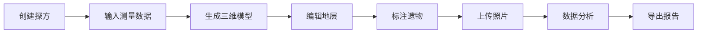

## 1. 产品概述

考古探方三维记录平台是一个专业的考古数字化工具，用于记录、可视化和管理考古发掘现场的探方数据。平台通过Three.js技术将探方测量数据转换为三维模型，支持地层编辑、遗物标注、照片关联和数据分析功能。

- **核心价值**：实现考古发掘记录的数字化、三维化和可视化管理
- **目标用户**：考古工作者、文物保护人员、考古研究机构
- **解决问题**：传统纸质记录难以直观展示地层关系，遗物位置难以精确标注，数据难以共享和分析

## 2. 核心功能

### 2.1 用户角色
| 角色 | 注册方式 | 核心权限 |
|------|----------|----------|
| 考古工作者 | 账号注册 | 探方管理、地层编辑、遗物标注、照片上传 |
| 管理员 | 系统创建 | 用户管理、数据备份、系统配置 |

### 2.2 功能模块
1. **探方模型生成**：输入测量数据，自动生成三维探方模型
2. **地层编辑**：添加/删除地层，设置地层颜色和属性
3. **遗物标注**：在三维模型上标记遗物位置，关联详细信息
4. **照片管理**：上传照片，关联到探方、地层或遗物
5. **数据分析**：统计分析探方数据，生成报告

### 2.3 页面详情
| 页面名称 | 模块名称 | 功能描述 |
|----------|----------|----------|
| 探方列表页 | 探方管理 | 探方列表展示、搜索、新建、删除 |
| 三维视图页 | 模型展示 | Three.js三维探方模型渲染、旋转、缩放 |
| 地层编辑页 | 地层管理 | 地层属性编辑、颜色设置、层次调整 |
| 遗物标注页 | 遗物管理 | 遗物位置标记、属性编辑、照片关联 |
| 照片库页 | 照片管理 | 照片上传、分类、预览、删除 |
| 数据分析页 | 数据统计 | 探方数据统计、图表展示、报告导出 |

## 3. 核心流程

## 4. 界面设计

### 4.1 设计风格
- **主色调**：土褐色 (#8B4513) - 体现考古主题
- **辅助色**：砂岩色 (#F4A460)、深棕色 (#5D4037)
- **按钮风格**：圆角矩形，轻微阴影，悬停效果
- **字体**：思源宋体 (标题) + 思源黑体 (正文)
- **布局风格**：左侧导航 + 主内容区 + 右侧属性面板
- **图标风格**：线性图标，考古相关元素

### 4.2 页面设计概览
| 页面名称 | 模块名称 | UI元素 |
|----------|----------|--------|
| 三维视图页 | 模型展示 | 大尺寸Canvas画布、工具栏、地层图例、属性面板 |
| 地层编辑页 | 地层管理 | 地层列表卡片、颜色选择器、层级拖拽排序 |
| 遗物标注页 | 遗物管理 | 三维坐标输入、遗物分类下拉、照片上传区域 |

### 4.3 响应式设计
- 桌面端优先设计，支持1920×1080及以上分辨率
- 平板端：侧边栏可折叠，属性面板移至底部
- 移动端：简化视图，主要功能以列表形式展示

### 4.4 3D场景指导
- **环境**：中性灰色背景，柔和的环境光
- **光照**：主光源 + 环境光 + 补光，确保模型细节清晰
- **相机**：轨道控制器，支持旋转、缩放、平移
- **交互**：点击地层/遗物显示详情，拖拽调整视角
- **效果**：地层半透明叠加，选中物体高亮显示
