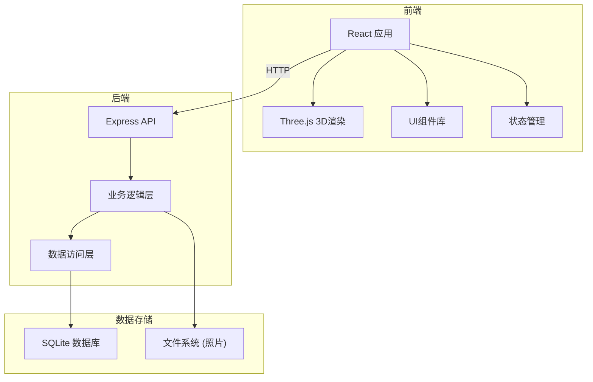
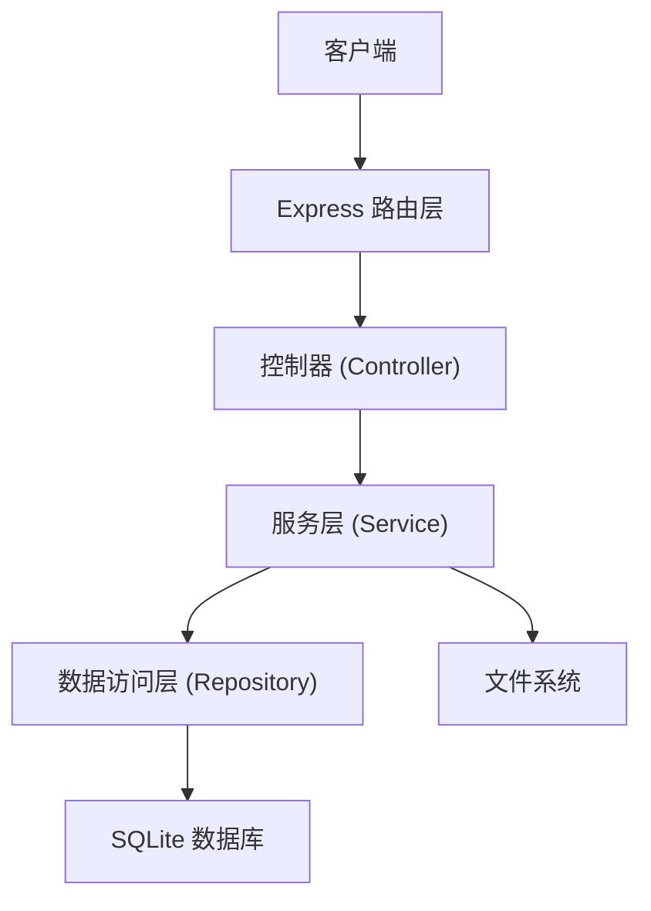
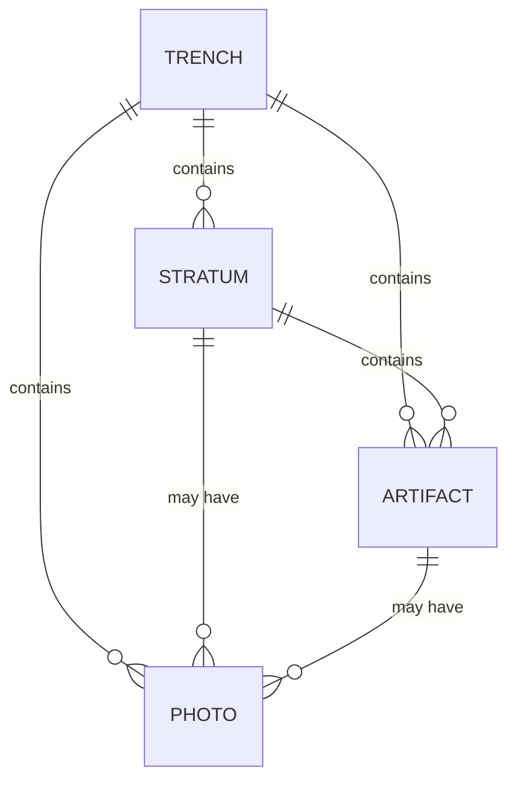

## 1. 架构设计



## 2. 技术说明

- **前端**：React@18 + TypeScript + Vite + TailwindCSS@3
- **3D引擎**：Three.js + @react-three/fiber + @react-three/drei
- **后端**：Express@4 + TypeScript
- **数据库**：SQLite (本地文件数据库，便于部署)
- **文件存储**：本地文件系统 (存储上传的照片)
- **图表库**：Recharts (数据分析图表)

## 3. 路由定义

| 路由 | 用途 |
|------|------|
| / | 探方列表页 |
| /trench/:id | 探方三维视图页 |
| /trench/:id/strata | 地层编辑页 |
| /trench/:id/artifacts | 遗物标注页 |
| /trench/:id/photos | 照片库页 |
| /trench/:id/analytics | 数据分析页 |

## 4. API定义

```typescript
// 探方相关类型
interface Trench {
  id: string;
  name: string;
  location: string;
  dimensions: {
    length: number;
    width: number;
    depth: number;
  };
  createdAt: string;
  updatedAt: string;
}

// 地层相关类型
interface Stratum {
  id: string;
  trenchId: string;
  name: string;
  color: string;
  description: string;
  depth: {
    top: number;
    bottom: number;
  };
  order: number;
}

// 遗物相关类型
interface Artifact {
  id: string;
  trenchId: string;
  stratumId: string | null;
  name: string;
  type: string;
  position: {
    x: number;
    y: number;
    z: number;
  };
  description: string;
  photoIds: string[];
}

// 照片相关类型
interface Photo {
  id: string;
  trenchId: string;
  stratumId: string | null;
  artifactId: string | null;
  filename: string;
  originalName: string;
  url: string;
  description: string;
  uploadedAt: string;
}

// API接口
// GET /api/trenches - 获取探方列表
// POST /api/trenches - 创建探方
// GET /api/trenches/:id - 获取探方详情
// PUT /api/trenches/:id - 更新探方
// DELETE /api/trenches/:id - 删除探方

// GET /api/trenches/:id/strata - 获取地层列表
// POST /api/strata - 创建地层
// PUT /api/strata/:id - 更新地层
// DELETE /api/strata/:id - 删除地层

// GET /api/trenches/:id/artifacts - 获取遗物列表
// POST /api/artifacts - 创建遗物
// PUT /api/artifacts/:id - 更新遗物
// DELETE /api/artifacts/:id - 删除遗物

// GET /api/trenches/:id/photos - 获取照片列表
// POST /api/photos - 上传照片
// DELETE /api/photos/:id - 删除照片
```

## 5. 服务器架构



## 6. 数据模型

### 6.1 ER图



### 6.2 DDL语句

```sql
-- 探方表
CREATE TABLE trenches (
  id TEXT PRIMARY KEY,
  name TEXT NOT NULL,
  location TEXT,
  length REAL NOT NULL,
  width REAL NOT NULL,
  depth REAL NOT NULL,
  created_at TEXT NOT NULL,
  updated_at TEXT NOT NULL
);

-- 地层表
CREATE TABLE strata (
  id TEXT PRIMARY KEY,
  trench_id TEXT NOT NULL,
  name TEXT NOT NULL,
  color TEXT NOT NULL,
  description TEXT,
  top_depth REAL NOT NULL,
  bottom_depth REAL NOT NULL,
  order_index INTEGER NOT NULL,
  FOREIGN KEY (trench_id) REFERENCES trenches(id) ON DELETE CASCADE
);

-- 遗物表
CREATE TABLE artifacts (
  id TEXT PRIMARY KEY,
  trench_id TEXT NOT NULL,
  stratum_id TEXT,
  name TEXT NOT NULL,
  type TEXT NOT NULL,
  pos_x REAL NOT NULL,
  pos_y REAL NOT NULL,
  pos_z REAL NOT NULL,
  description TEXT,
  FOREIGN KEY (trench_id) REFERENCES trenches(id) ON DELETE CASCADE,
  FOREIGN KEY (stratum_id) REFERENCES strata(id) ON DELETE SET NULL
);

-- 照片表
CREATE TABLE photos (
  id TEXT PRIMARY KEY,
  trench_id TEXT NOT NULL,
  stratum_id TEXT,
  artifact_id TEXT,
  filename TEXT NOT NULL,
  original_name TEXT NOT NULL,
  description TEXT,
  uploaded_at TEXT NOT NULL,
  FOREIGN KEY (trench_id) REFERENCES trenches(id) ON DELETE CASCADE,
  FOREIGN KEY (stratum_id) REFERENCES strata(id) ON DELETE SET NULL,
  FOREIGN KEY (artifact_id) REFERENCES artifacts(id) ON DELETE SET NULL
);
```
